# Welcome to the SWEETiVERSE
** Boldly explore SWEETiS from every corner of the world... and beyond!**

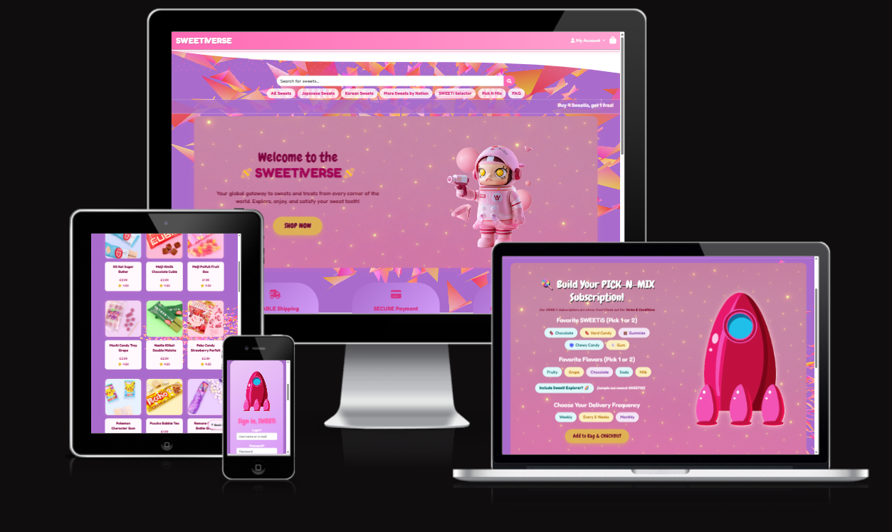

[Link to deployed site](https://sweetiverse-24537debe589.herokuapp.com/)

SWEETiVERSE was born of a mixture of nostalgia, wanderlust, and a wicked sweet tooth. My husband and I live on a farm in the countryside, and while working with horses is my great passion, it certainly puts a limit on vacation of any sort. Lately I've been feeling a yearning for the kind of travel we used to do when we first met, back when life was slower and wandering a grocery aisle in a foreign country was a favorite pastime.

Bright colors, wild mascots, flavors we’d never heard of in languages we couldn't read: Sensory overload in the best way possible.

This project is my way of bottling that experience into an interactive web app. I wanted to create a bright, playful digital candyshop where users could explore international sweets, browse by country, leave reviews, create wishlists, and build in fun extras like the Pick-N-Mix subscription surprise box and retro-feel SWEETiSelector sweet suggestor.

SWEETiVERSE is a full-stack Django application with:

- Custom shopping cart and Stripe integration for secure checkout

- User authentication and profiles via Django Allauth

- Reviews and wishlist functionality for engagement

- Promo code logic and automatic discount triggers (like our SWEETiStravaganza)

- Dynamic forms and AJAX enhancements for a smooth UX

- Mobile-responsive design, SEO considerations, and custom toasts for feedback

It’s built with a mix of HTML, CSS, Bootstrap, JavaScript, and Python, and deployed via Heroku.

This project pushed me to go deeper with Django’s session handling, context processors, model design, and payment workflows. I thoroughly enjoyed designing something that feels equal parts functional and joyful.

You can visit the site [here](https://sweetiverse-24537debe589.herokuapp.com/) 

You can register as a new user, explore the inventory, add SWEETiS to your shopping bag, and test our subscription and checkout processes [starting here](https://sweetiverse-24537debe589.herokuapp.com/accounts/signup/)

Use the [Stripe Dummy Card](https://stripe.com/docs/testing) to simulate the purchasing process:

- Use Card Number: 4242424242424242
- Expiration Date: Any future date in MM/YY format
- CVN: any 3 numerals
- Postcode: any 5 digits

 No money will be charged or transferred, it is purely a simulated checkout integrated with Stripe-- so go wild! Order the whole store if you'd like!

You can login as an admin to take a peak behind the curtain. Examine how the store/site owner adds sweets and manages user information [here:](https://sweetiverse-24537debe589.herokuapp.com/admin)(necessary credentials required) 

Thanks for visiting SWEETiVERSE. I hope it makes you smile ✨

# Table of Contents

-   [User Experience](#user-experience)
    -   [User Stories](#user-stories)
    -   [Site Goals](#site-goals)
    -   [Scope](#scope)
-   [Design](#design)
    -   [Colour Scheme](#colour-scheme)
    -   [Database Schema](#Database-Schema)
    -   [Fonts](#Fonts)
    -   [Wireframes](#Wireframes)
    -   [Agile Methodology](#Agile-Methodology)
         -   [Overview](#overview)
         -   [EPICS(Milestones)](#epicsmilestones)
         -   [User Stories issues](#user-stories-issues)
         -   [MoSCoW prioritization](#moscow-prioritization)
         -   [GitHub Projects](#github-projects)
-   [Features](#features)
-   [Future Features](#future-features)
-   [Marketing](#marketing)
-   [Search Engine Optimization SEO](#search-engine-optimization-seo)
-   [Testing](#testing)
-   [Bugs](#Bugs)
-   [Technologies And Languages](#technologies-and-languages)
    -   [Languages Used](#languages-used)
    -   [Python Modules](#python-modules)
    -   [Technologies and programs](#technologies-and-programs)
-   [Deployment](#deployment)
    -   [Before Deployment](#before-deployment)
    -   [Deployment on Heroku](#deployment-on-heroku)
    -   [Creating A Fork](#creating-a-fork)
    -   [Cloning Repository](#cloning-repository)
-   [Credits](#credits)
    -   [Media](#media)
    -   [Code](#code)
    -   [Acknowledgements](#acknowledgements)
    -   [Comments](#comments)

## User Experience

### User Stories

| **User Stories** | **Description** | **Status** |
| --- | --- | --- |

| US - Project Setup | As a **developer** I can set up a new Django project so that I can establish the project structure. | ✅ |
| US - Storage Setup | As a **developer** I can connect the database and media storage so that user data and images are stored successfully. | ✅ |
| US - Early Deployment | As a **developer** I can deploy the application early so that I can verify everything works and continue testing during development. | ✅ |

| US - Homepage | As a **user** I can visit the homepage so I understand the purpose of Sweetiverse. | ✅ |
| US - Navigation | As a **user** I can navigate the website efficiently to access different sections like products, help, or cart. | ✅ |
| US - Browse Sweets | As a **user** I want to be able to view all available sweets so that I can browse and discover treats to purchase. | ✅ |
| US - Sweet Details | As a **user** I want to view detailed information about a single sweet so I can make informed decisions. | ✅ |
| US - Filter Sweets | As a **user** I want to filter sweets by country or category so I can find exactly what I’m interested in. | ✅ |
| US - Search Sweets | As a **user** I want to search for sweets by keywords so that I can quickly find specific items. | ✅ |
| US - Sort Sweets | As a **user** I want to sort the sweet list by name or price so I can easily compare options. | ✅ |

| US - Register | As a **user** I want to register an account so I can access full functionality. | ✅ |
| US - Login | As a **user** I want to log in to my account so I can personalize my experience. | ✅ |
| US - Password Reset | As a **user** I want to reset my password if I forget it so I can regain access. | ✅ |
| US - Profile Update | As a **user** I want to update my profile information so I can keep my account current. | ✅ |
| US - Submit Review | As an **authenticated user** I want to leave reviews for sweets so I can share feedback. | ✅ |
| US - Edit/Delete Review | As an **authenticated user** I want to edit or delete my reviews to keep them relevant. | ✅ |
| US - Wishlist | As an **authenticated user** I want to add sweets to my wishlist so I can save them for later. | ✅ |

| US - Add to Cart | As a **user** I want to add products to my cart so I can review them before purchase. | ✅ |
| US - Remove from Cart | As a **user** I want to remove items from my cart so I can adjust my order. | ✅ |
| US - Adjust Quantity | As a **user** I want to adjust the quantity of items in my cart for accurate purchasing. | ✅ |
| US - Apply Discount | As a **user** I want to apply discount codes to get deals and savings. | ✅ |
| US - Stripe Payment | As a **user** I want to securely pay for items using Stripe so I can complete purchases confidently. | ✅ |
| US - Smooth Checkout | As a **user** I want to complete checkout easily so I can buy sweets without friction. | ✅ |

| US - Admin Dashboard | As an **admin** I want to view an admin dashboard to monitor orders and activity. | ✅ |
| US - Manage Inventory | As an **admin** I want to add, update, or delete sweets so I can manage the inventory. | ✅ |
| US - Adjust Stock | As an **admin** I want to adjust stock levels to maintain availability. | ✅ |

| US - Submit Testimonial | As a **user** I want to submit a testimonial about my experience to share feedback. | ✅ |
| US - View Testimonials | As a **user** I want to read other users’ testimonials to build trust. | ✅ |
| US - Newsletter Signup | As a **user** I want to sign up for a newsletter so I can stay updated with offers. | ✅ |

| US - SEO Optimization | As the **site owner** I want the site to be SEO optimized so Sweetiverse ranks higher and attracts more users. | ✅ |

---

### Site Goals

- Provide users with a global marketplace for international sweets.
- Allow users to browse, search, and filter sweets by country or type.
- Enable customers to register accounts, manage orders, and maintain wishlists.
- Support user-generated reviews and testimonials on sweets.
- Streamline and secure the checkout process.

---

### Scope

The project aims to deliver a responsive and user-friendly sweets e-commerce platform. Core features include:

- User registration, login, and password reset  
- Sweet browsing, searching, filtering, and sorting  
- Product detail pages  
- Shopping cart (add, remove, update items)  
- Wishlist functionality  
- Reviews and testimonials  
- Secure checkout using Stripe  
- Newsletter signup  
- Admin management for inventory and orders

## Design

### Color Scheme

I chose this palette to capture the whimsical spirit of candy culture. Bright pinks and purples for nostalgia and fun, with deeper accents for contrast and richness. These colors reflect the bold packaging, flavors, and certain je ne sais quoi and whimsy of foreign sweeties. 

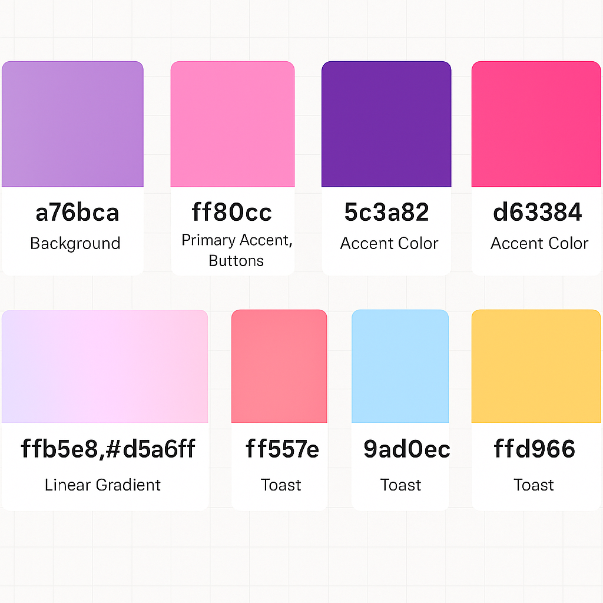

### Database Schema
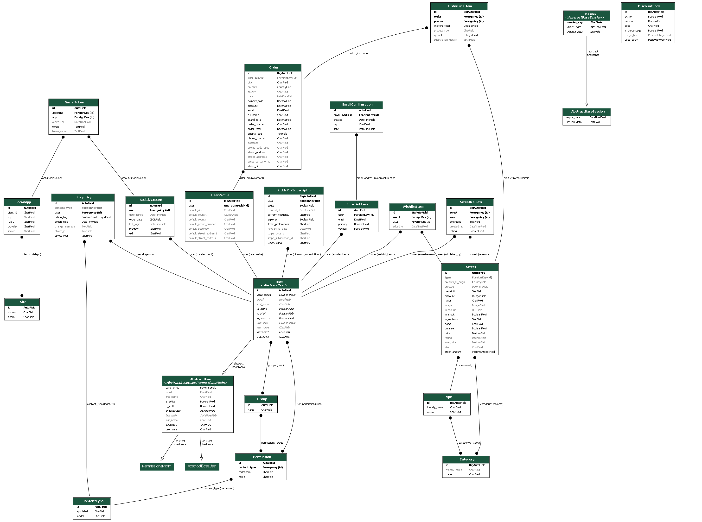

First Draft ERD

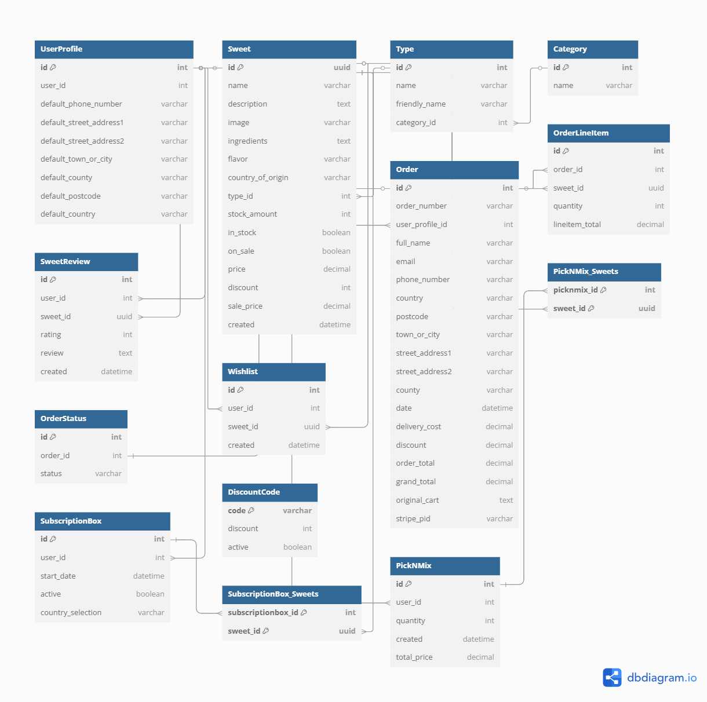

#### User & Authentication Models

##### User
Django’s built-in auth.User model is used for authentication. Extended by UserProfile.

##### User Profile
| Field Name              | Field Type         | Relationship              | Description                                      |
|------------------------|--------------------|---------------------------|--------------------------------------------------|
| id                     | AutoField          | Primary Key               | Unique ID for the profile                        |
| user                   | OneToOneField      | User                      | Links to Django's built-in user                  |
| default_phone_number   | CharField          | –                         | Stored for convenience at checkout               |
| default_street_address1| CharField          | –                         | Shipping address line 1                          |
| default_street_address2| CharField          | –                         | Shipping address line 2                          |
| default_town_or_city   | CharField          | –                         | User's city                                      |
| default_county         | CharField          | –                         | User's county                                    |
| default_postcode       | CharField          | –                         | Postal code                                      |
| default_country        | CountryField       | –                         | Country of the user                              |

#### Product Models

##### Sweet
| Field Name         | Field Type    | Relationship     | Description                            |
|--------------------|---------------|------------------|----------------------------------------|
| id                 | UUIDField     | Primary Key      | Unique product ID                      |
| name               | CharField     | –                | Product name                           |
| description        | TextField     | –                | Full description                       |
| image              | ImageField    | –                | Product image                          |
| ingredients        | TextField     | –                | Ingredients list                       |
| flavor             | CharField     | –                | Flavor description                     |
| country_of_origin  | CountryField  | –                | Country where the sweet originates     |
| type               | ForeignKey    | Type             | Type of sweet                          |
| stock_amount       | IntegerField  | –                | Stock level                            |
| in_stock           | BooleanField  | –                | Availability flag                      |
| on_sale            | BooleanField  | –                | If discounted                          |
| price              | DecimalField  | –                | Regular price                          |
| discount           | IntegerField  | –                | Discount percent                       |
| sale_price         | DecimalField  | –                | Price after discount                   |
| created            | DateTimeField | –                | Creation timestamp                     |

##### Type
| Field Name    | Field Type  | Relationship  | Description                  |
|---------------|-------------|---------------|------------------------------|
| id            | AutoField   | Primary Key   | Unique type ID               |
| name          | CharField   | –             | Internal name                |
| friendly_name | CharField   | –             | Display name for UI          |
| category      | ForeignKey  | Category      | Associated category           |

##### Category
| Field Name | Field Type | Description               |
|------------|------------|---------------------------|
| name       | CharField  | High-level category label |

#### Reviews & Wishlist

#### SweetReview
| Field Name | Field Type     | Relationship   | Description                    |
|------------|----------------|----------------|--------------------------------|
| user       | ForeignKey     | UserProfile    | Reviewer                       |
| sweet      | ForeignKey     | Sweet          | Reviewed item                  |
| rating     | IntegerField   | –              | Rating out of 5                |
| review     | TextField      | –              | User comment                   |
| created    | DateTimeField  | –              | Submission date                |

##### WishListItem
| Field Name | Field Type     | Relationship   | Description                    |
|------------|----------------|----------------|--------------------------------|
| user       | ForeignKey     | UserProfile    | Wishlist owner                 |
| sweet      | ForeignKey     | Sweet          | Saved sweet                    |
| created    | DateTimeField  | –              | Date added                     |

#### Orders & Checkout

##### Order
| Field Name        | Field Type      | Relationship   | Description                     |
|-------------------|-----------------|----------------|---------------------------------|
| id                | AutoField       | Primary Key    | Order ID                        |
| order_number      | CharField       | –              | Unique reference code           |
| user_profile      | ForeignKey      | UserProfile    | Associated user                 |
| full_name         | CharField       | –              | Billing name                    |
| email             | EmailField      | –              | Contact email                   |
| phone_number      | CharField       | –              | Phone number                    |
| country           | CountryField    | –              | Country of delivery             |
| postcode          | CharField       | –              | Postal code                     |
| town_or_city      | CharField       | –              | City                            |
| street_address1   | CharField       | –              | Address line 1                  |
| street_address2   | CharField       | –              | Address line 2                  |
| county            | CharField       | –              | Region/county                   |
| date              | DateTimeField   | –              | Order timestamp                 |
| delivery_cost     | DecimalField    | –              | Shipping fee                    |
| discount          | DecimalField    | –              | Discount amount                 |
| order_total       | DecimalField    | –              | Total cost before shipping      |
| grand_total       | DecimalField    | –              | Total with shipping             |
| original_cart     | TextField       | –              | Snapshot of user’s cart         |
| stripe_pid        | CharField       | –              | Stripe PaymentIntent ID         |

##### OrderLineItem
| Field Name     | Field Type     | Relationship | Description                   |
|----------------|----------------|--------------|-------------------------------|
| order          | ForeignKey     | Order        | Linked order                  |
| sweet          | ForeignKey     | Sweet        | Item ordered                  |
| quantity       | IntegerField   | –            | Units purchased               |
| lineitem_total | DecimalField   | –            | Subtotal for this item        |

##### OrderStatus
| Field Name | Field Type    | Relationship | Description                      |
|------------|---------------|--------------|----------------------------------|
| order      | OneToOneField | Order        | Associated order                 |
| status     | CharField     | –            | Status label (e.g., Shipped)     |

##### DiscountCode
| Field Name | Field Type   | Description                           |
|------------|--------------|---------------------------------------|
| code       | CharField    | Coupon code for checkout              |
| discount   | IntegerField | Percent discount                      |
| active     | BooleanField | Whether code is valid or expired      |

#### Pick n’ Mix & Subscriptions

##### PickNMixSelectionOptions
| Field Name   | Field Type      | Relationship   | Description                         |
|--------------|-----------------|----------------|-------------------------------------|
| user         | ForeignKey      | UserProfile    | Bundle creator                      |
| quantity     | IntegerField    | –              | Total sweets in the mix             |
| created      | DateTimeField   | –              | When it was created                 |
| sweets       | ManyToManyField | Sweet          | Selected sweets                     |
| total_price  | DecimalField    | –              | Cost of the entire mix              |

##### SubscriptionBox
| Field Name         | Field Type      | Relationship   | Description                        |
|--------------------|-----------------|----------------|------------------------------------|
| user               | ForeignKey      | UserProfile    | Subscriber                         |
| start_date         | DateTimeField   | –              | Date of first delivery             |
| active             | BooleanField    | –              | Is the box still active?           |
| country_selection  | CharField/JSON  | –              | Optional country preferences       |
| sweets             | ManyToManyField | Sweet          | Sweets included in the box         |

#### Email & Contact

##### EmailSubscription
| Field Name  | Field Type     | Description                        |
|-------------|----------------|------------------------------------|
| email       | EmailField     | Email to receive newsletters       |
| timestamp   | DateTimeField  | When subscribed                    |

##### EmailContactSubmission
| Field Name | Field Type     | Description                        |
|------------|----------------|------------------------------------|
| email      | EmailField     | Sender's email                     |
| subject    | CharField      | Message subject                    |
| message    | TextField      | Message content                    |
| created    | DateTimeField  | Submission timestamp               |

### Fonts

The fonts for SWEETiVERSE were chosen to strike a balance between attentiong grabbing and readability, each appropriately whimsical and in the spirit of cartoonesque discovery. Chewy adds a sweet, bubblegum charm, while Fredoka brings a retro vibe that feels bold, commanding, and perfect for candy mission control

### Wireframes

Home

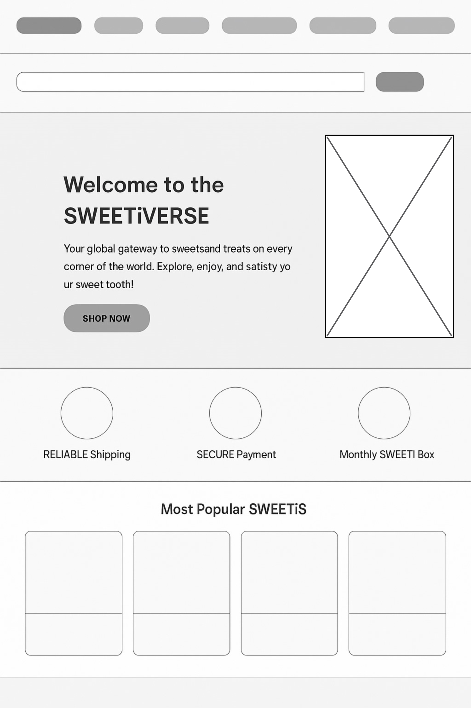

Sweets

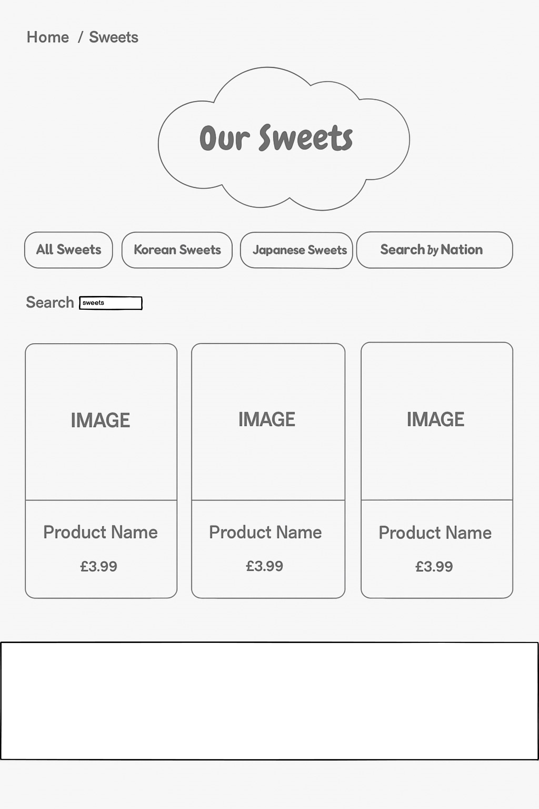

Search

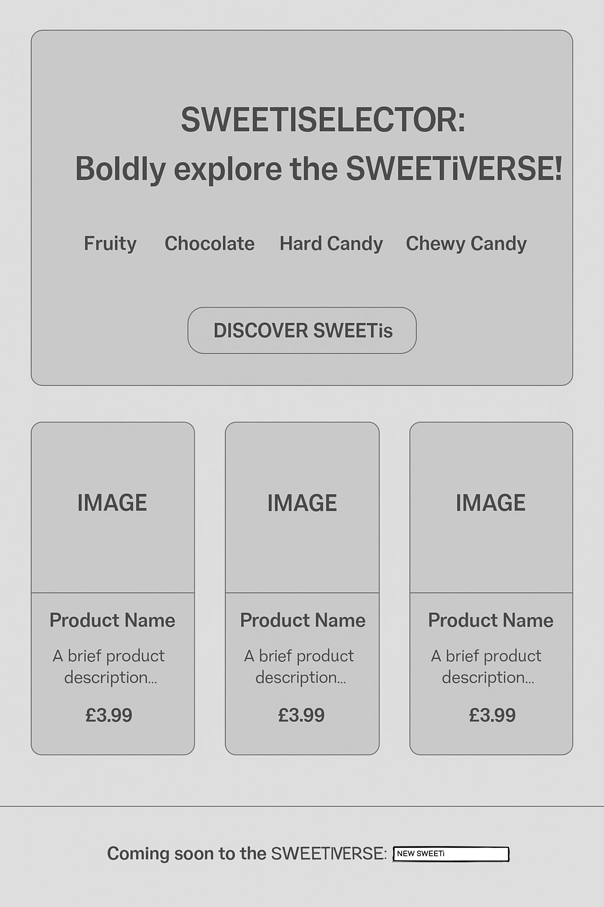

SWEETi Selector

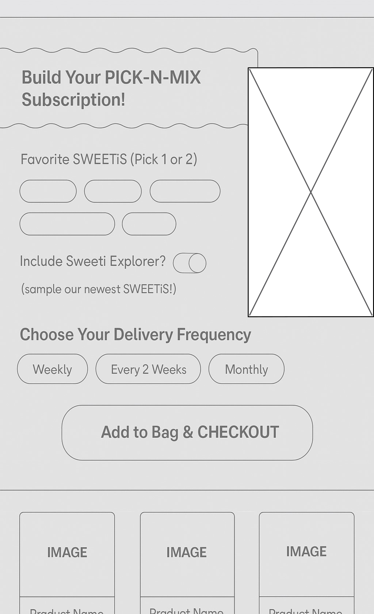

Pick N Mix

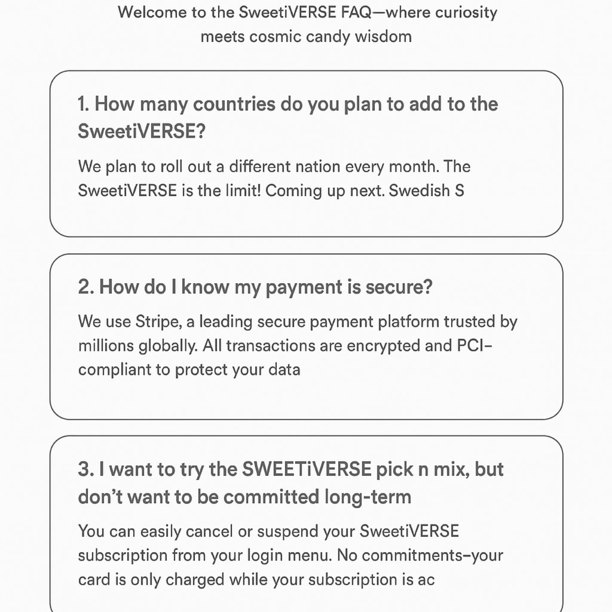

# Agile Methodology

## GitHub Projects Board – Workflow for Sweetiverse
To plan and manage the development of Sweetiverse, I utilized GitHub’s built-in Projects tool. The Kanban board allowed me to clearly track progress, identify issues early, and organize development around my user stories.

Throughout the development process, I recorded each user story as an issue. I added developer tasks and bugs as well, though I could have documented minor errors and small bugs more thoroughly as I worked. These issues were grouped under relevant milestones and categorized using MoSCoW prioritization labels. Each issue was further detailed with clear acceptance criteria and a breakdown of required tasks. This ensured that every piece of work had a purpose, scope, and a measurable outcome.

Issues progressed through the following board columns:

- Backlog: For brainstorming and unrefined ideas.

- To Do: Planned tasks ready to be worked on.

- In Progress: Actively being developed or debugged.

- Blocked: Items temporarily paused due to dependencies.

- Done: Completed and tested work.

- Won’t Have: Deferred or discarded for the current release

## MoSCoW Prioritization
To keep development focused, I adopted the MoSCoW method for prioritizing user stories and features:

- Must Have: Core functionality like viewing sweets, checkout, and authentication.

- Should Have: Features like wishlists, reviews, and search filters.

- Could Have: Enhancements like newsletter signup or subtle UI improvements.

- Won’t Have (for now): Deferred ideas or stretch features planned for future versions

## Project Milestones
The project was divided into several key milestones:

- Project Setup: Initializing the Django project, repo setup, static/media config, and base templates.

- Products: Building the sweets app, views, and templates. Core features like browsing, sorting, and filtering were delivered here.

- User Profiles: Registration, login/logout, email confirmation, profile management, and saved preferences.

- Orders: Shopping bag, discount code logic, Stripe checkout, and order recording.

- Admin: Admin interface setup, inventory control, and order visibility.

- Testimonials: Reviews and ratings by users.

- Marketing/SEO: Metadata optimization, social sharing previews, and sitemap configuration.

- Documentation: Writing the README, manual testing documentation, and issue documentation.

- Backlog: Miscellaneous enhancements, future feature ideas, or things outside MVP scope.

### In Future Iterations
I plan to better automate issue-linking to commits and rely more heavily on GitHub’s automation tools (like actions and issue templates)

Overall, GitHub Projects offered visibility, flexibility, and control during the SWEETiVERSE development process

## Site Structure

# Features

## User View - Guests/Account Holders

| Feature   | Guest | Registered, Account Holder |
|-----------|-------------------|-----------------|
| Home Page | Visible           | Visible         |

## CRUD Functionality

## Feature Details

### Home Page and Base.html

#### User Dropdown Menu

#### Navigation Links

#### Search Bar

#### Trust Badges

#### Most Popular SWEETis

#### Contact

#### Testimonial Carousel 

#### Mailchimp Integrated Newsletter Signup

#### Footer

#### Privacy Policy

### User Registration and Login/Logout/Password Reset

### Sweets Page

#### Breadcrumbs

#### Searching Sweets

#### Product Information Card

#### User Ratings and Reviews

#### Wishlist

### User Bag and Checkout Process

### Sweeti Selector

### Pick N Mix Subscriptions

### FAQ

### Deletion Pop Ups

### 404 and 500 Error Pages

# Future Features

- Custom Admin Panel
- Send a SWEETi PICK N MIX Subscription box as a gift (this can already be done but does not appear as a button or link)
- SWEETi of the Month newsletter and discount code
- Pick N Mix subscription option to select SWEETiS from only 1 or 2 nations
- Irish, British, American, Swedish, Nigerian, Mexican, ETC(!) SWEETis

# Technologies Used
## Languages
## Frameworks and Software
# Python Packages
# Testing
# Project Deployment

# Marketing

## Target Audience & Platforms

SweetiVERSE is designed for international candy lovers, curious foodies, and expats who enjoy monthly tasting experiences. Our audience:

- Aged 18–40 (but designed to be visually and thematically appealing to children as well!)  
- Active on social platforms (Instagram, TikTok, Facebook)  
- Interested in gifting, novelty, and subscription boxes  
- Values personalization, cultural discovery, and nostalgia

**Primary Platforms for Outreach:**

- **Instagram & TikTok** – Visual, short-form content (unboxings, taste reactions)  
- **Facebook** – Business visibility, ads, and longer-form posts  
- **Email** – Newsletters, discounts, previews, and retention messaging

**Facebook Page**

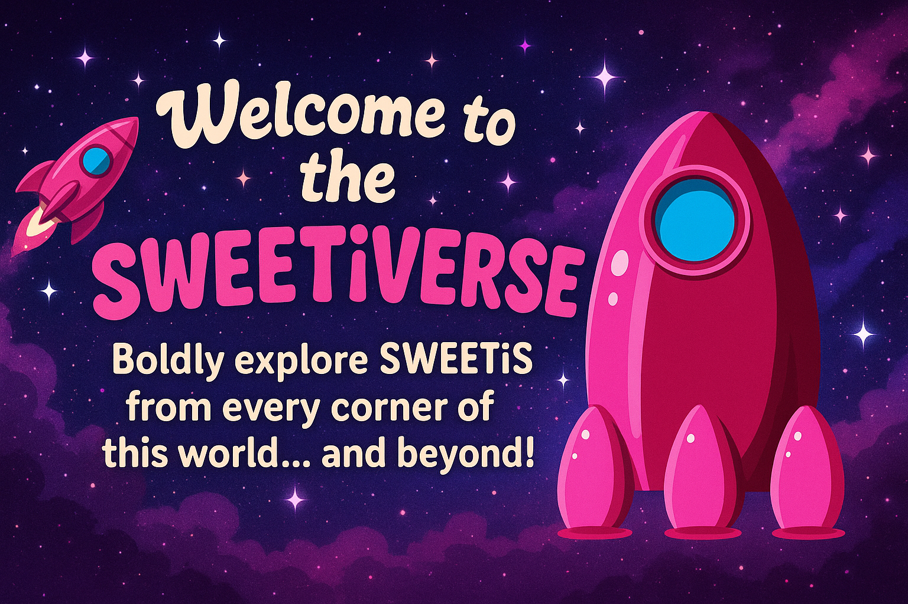

SWEETiVERSE Facebook  (click)

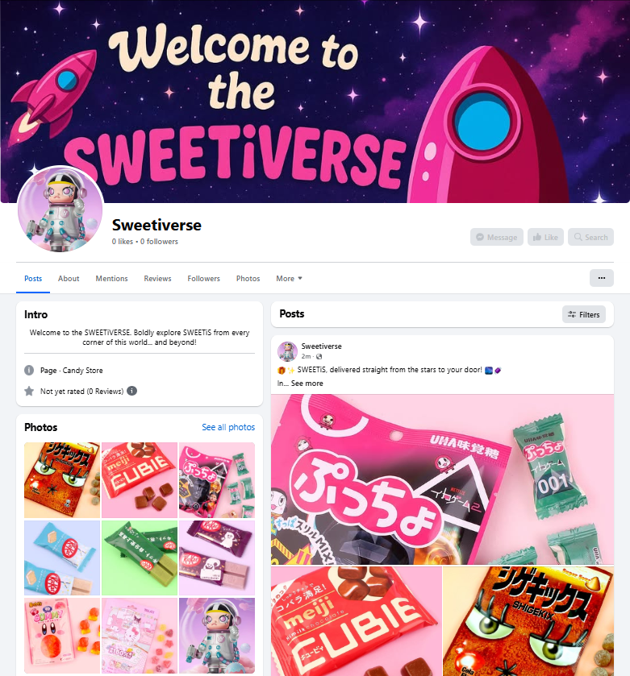

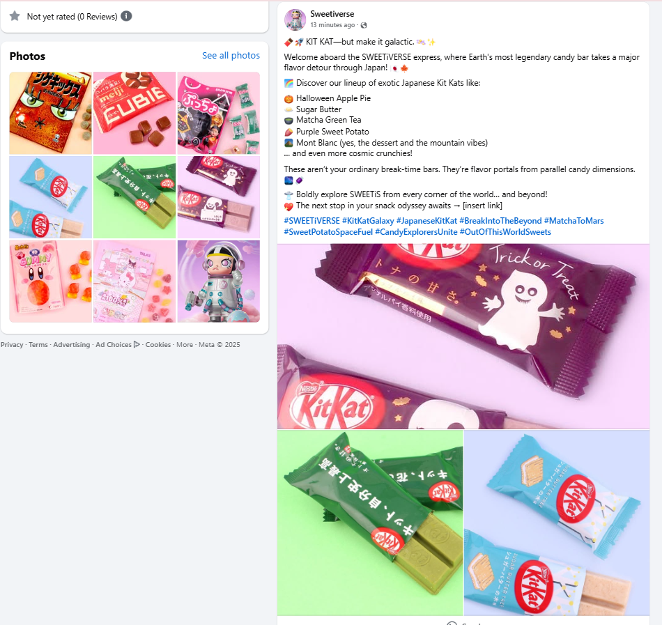

## Marketing Strategy Overview

SweetiVERSE integrates five core marketing strategies to reach and engage customers:

### 1. Search Engine Optimization (SEO)

- Meta tags per page (title, description)
- Semantic HTML and accessibility-compliant structure
- Optimized image alt text and filenames
- Focus keywords include:
  - "Korean sweets online"
  - "international pick n mix subscription"
  - "Japanese candy box delivery Ireland"

### 2. Content Marketing

- Planned blog with monthly editorial content:
  - Sweeti spotlights and box features
  - Cultural and seasonal sweeti stories
- Content tailored to support SEO and shareability

### 3. Social Media Marketing

**Organic Strategy:**

- Community engagement via polls, comments, and reels
- Featuring user-generated content and reactions

**Paid Strategy:**

- Instagram and Facebook ads
- Retargeting campaigns for cart abandoners

### 4. Email Marketing

- Newsletter signup integrated via Mailchimp
- Automated sequences:
  - Welcome emails
  - Monthly previews
  - Promotions and seasonal offers

### 5. Paid Advertising

- Google Ads with targeted keyword bidding
- Social retargeting (future goal with consent)
- A/B testing to refine approach

---

## Tracking & Analytics

(Marketing Future Features)

| Tool                | Purpose                                      |
|---------------------|----------------------------------------------|
| Google Analytics    | Measure traffic, bounce rate, and engagement |
| Mailchimp Analytics | Track open and click-through rates           |
| Meta Ads Manager    | Review ad spend performance                  |
| Instagram Insights  | Monitor post and story engagement            |

---

## GDPR & Data Protection

SweetiVERSE follows GDPR best practices:

- Privacy Policy linked in site footer
- Double opt-in newsletter via Mailchimp
- No pre-checked marketing boxes
- Future cookie consent banner planned for analytics usage

---

## Strategy Timeline

| Phase   | Key Activities                                                    |
|---------|-------------------------------------------------------------------|
| Month 1 | Initial SEO setup, launch Instagram and Facebook pages            |
| Month 2 | Begin blog posts, start newsletter signups, share via socials     |
| Month 3 | Launch paid ads, initiate retargeting with compliant tracking     |
| Month 4+| Monthly Sweeti updates, optimize based on analytics and feedback  |

---

## Summary

The SWEETiVERSE marketing plan is designed to balance cost-effectiveness, discoverability, and customer engagement. Using SEO, content creation, email retention, and scalable social media tactics, SWEETiVERSE aims to build a loyal, growing community of global sweet-lovers.

# Search Engine Optimization SEO

## SEO Keyword Research Process

### Business Description
SweetiVERSE is an e-commerce application offering a customizable international pick-n-mix sweets subscription. Users can create a personalized sweets box with candy from various countries and themes, with future expansions planned for additional regions and dietary options.

### 1. Brainstorm General Topics

These are core subject areas relevant to SweetiVERSE:

- Pick n mix
- International candy
- Subscription boxes
- Sweet treats
- Global sweets
- Candy delivery
- Themed sweets
- Allergen-safe sweets (Future Feature)
- Limited edition and new Kit Kats

---

### 2. Brain Dump of Keyword Ideas

#### Pick n mix:
- pick n mix
- pick and mix sweets
- online pick n mix
- custom pick n mix box

#### International candy:
- candy from around the world
- international sweets
- sweets from Europe
- Japanese candy box
- Korean sweets online
- unique kit kat flavors

#### Subscription:
- candy subscription
- monthly sweets box
- pick n mix subscription
- sweet subscription Ireland

#### Themed treats:
- themed candy boxes
- holiday candy box
- best sweets for gifts
- Japanese Kit Kats

#### Allergy-friendly:
- peanut-free sweets
- sugar-free candy
- gluten-free

---

### 3. Google Research Simulation

Using tools like Google autocomplete, "People Also Ask", and "Related Searches", I simulated search behavior and confirmed interest in the following:

- "Where to buy international candy?"
- "Best candy subscription box"
- "Candy box for kids with allergies"
- "Sweets from Japan"
- "How to make your own pick n mix?"

These results indicate active search interest in SweetiVERSE’s target features.

---

### 4. Final Keyword List

| Short-Tail Keywords           | Long-Tail Keywords                                       |
|------------------------------|----------------------------------------------------------|
| pick n mix                   | buy international candy online                          |
| candy subscription           | monthly pick and mix sweets box                         |
| international sweets         | pick n mix subscription box UK                          |
| themed candy                 | peanut-free sweets for kids                             |
| global sweets                | Swedish sweets subscription                             |
| sweetiverse                  | create your own pick n mix online                       |
| sweets delivery              | custom sweet box with global candy                      |
| allergen-free candy          | sugar-free candy options for monthly subscription       |

---

### 5. Keyword Strategy

The final keywords were selected based on the following criteria:

- **Relevance** to SweetiVERSE’s products and user needs
- **Balance** of short-tail and long-tail keywords
- **Specificity** to match high-intent user searches
- **Potentially lower competition** due to niche focus

This list will be used to optimize page titles, meta tags, headers, alt text, and on-page content.

## SEO-Friendly Meta Tags

screenshots

## Semantic HTML

screenshots

## Keywords in Page Content

screenshots

## Optimized Image Names and Alt Texts

screenshots

## Sitemap and Robots.txt

screenshots

## Meaningful Internal and External Links

screenshots

## FAQ Page

screenshots

## Clear, Trustworthy Content
(Terms & Conditions, Privacy Policy, Shipping Info, and Allergen Info) 

screenshots

## Track Engagement Metrics

Future Feature with Google Console CTR (Bounce Rate, dwell time, pages per session)

# Testing

View testing at [TESTING.md](/TESTING.md)

# Bugs

## Problems with Django Allauth and emails

- [example.com]
- email_confirm.html

# Project Deployment 
Early deployment was essential for SWEETiVERSE, not just to avoid end-of-project surprises, but to see how the experience translated across real devices. With a Django backend, Stripe integration, and AWS-hosted media, this app had a lot of moving parts. Deploying early gave me confidence they’d work together smoothly in production.

Here’s how to set up deployment using Heroku, Postgres, AWS S3, and Gmail:

## Initial Setup & Local Development
1. Start the Project

Initialize a repo on  github.

Launch VS Code and create a virtual environment.

Install Django, sqlite3 support, and other essentials:

pip install 'django<4' gunicorn dj_database_url psycopg2-binary
pip install boto3 django-storages

2. Setup Requirements File & Git

pip3 freeze > requirements.txt

Commit and push to GitHub regularly with detailed messages 

3. Configure Project Settings

env.py file for sensitive keys (e.g. SECRET_KEY, DATABASE_URL, etc.)

In settings.py:

import os
if os.path.isfile('env.py'):
    import env
DEBUG set to:

DEBUG = os.environ.get('DEVELOPMENT') == 'True'

4. Database

Created and connected to Postgres

Switched DATABASES config to use PostgreSQL in production:

DATABASES = {
    'default': dj_database_url.parse(os.environ.get("DATABASE_URL"))
}

Heroku Deployment
1. Create Heroku App

Logged in and created a new Heroku app from the Heroku dashboard.

Set config vars:

DATABASE_URL, SECRET_KEY, USE_AWS

Stripe keys, email credentials, etc.

2. Add Procfile & Push to Heroku

echo "web: gunicorn sweetiverse.wsgi:application" > Procfile
git push heroku main

3. Allowed Hosts

ALLOWED_HOSTS = ['sweetiverse.herokuapp.com', 'localhost']

4. Collect Static & Media

For production:

python manage.py collectstatic

AWS S3 Storage for Media & Static
Why? GitHub and Heroku don't store user-uploaded media.

Steps:

Created an AWS S3 bucket

Set up public read access (with CORS policy and Bucket Policy)

Created custom_storages.py:

from storages.backends.s3boto3 import S3Boto3Storage

class StaticStorage(S3Boto3Storage):
    location = 'static'

class MediaStorage(S3Boto3Storage):
    location = 'media'
In settings.py:

if 'USE_AWS' in os.environ:
    STATICFILES_STORAGE = 'custom_storages.StaticStorage'
    DEFAULT_FILE_STORAGE = 'custom_storages.MediaStorage'
AWS keys added to env.py and Heroku config vars.

Stripe Integration
Created a Stripe test account and added public/secret keys to environment.

Webhooks for Stripe events (like successful payment):

Set up endpoint in Stripe Dashboard to https://sweetiverse.herokuapp.com/checkout/wh/

Wrote webhook handler in Django to fulfill or cancel orders based on status.

Gmail Email Backend
Used Gmail to send registration and order confirmation emails.

Enabled 2FA in Gmail → Created app password

Added email credentials to env.py and Heroku

Configured Django's email backend:

EMAIL_BACKEND = 'django.core.mail.backends.smtp.EmailBackend'
EMAIL_HOST = 'smtp.gmail.com'
EMAIL_PORT = 587
EMAIL_USE_TLS = True
EMAIL_HOST_USER = os.environ.get('EMAIL_HOST_USER')
EMAIL_HOST_PASSWORD = os.environ.get('EMAIL_HOST_PASS')

Final Notes on Deployment
I regularly checked the live Heroku version to monitor changes.

GitHub issues tied to deployment helped track config steps.

Used Chrome DevTools and browser-stack-style emulators to test responsiveness across viewports.

Cloning & Running Locally
To run the project locally:

git clone https://github.com/yourusername/sweetiverse.git
cd sweetiverse
pip install -r requirements.txt
Create a .env file or env.py with your environment variables.

python3 manage.py migrate
python3 manage.py runserver

# Credits

## Media

### Images

- Starry backgrounds https://www.transparenttextures.com/
- Pink Spaceship https://www.vectorstock.com/
- Pick N Mix Lever https://uiverse.io/njesenberger/brave-firefox-90
- Spaceship Control Room https://thehungryjpeg.com/
- Japanese Sweet Images https://www.tofucute.com
- Korean Sweet Images https://www.japancandystore.com/
- Mega Space Molly images https://www.popmart.com
- Vector Speech Bubble https://www.freepik.com
- Vector Cloud https://www.fffuel.co
- Cloud Border https://pngtree.com/
- icons icons8
- fonts googlefonts
- font awesome
- Facebook cover image chatgpt.com