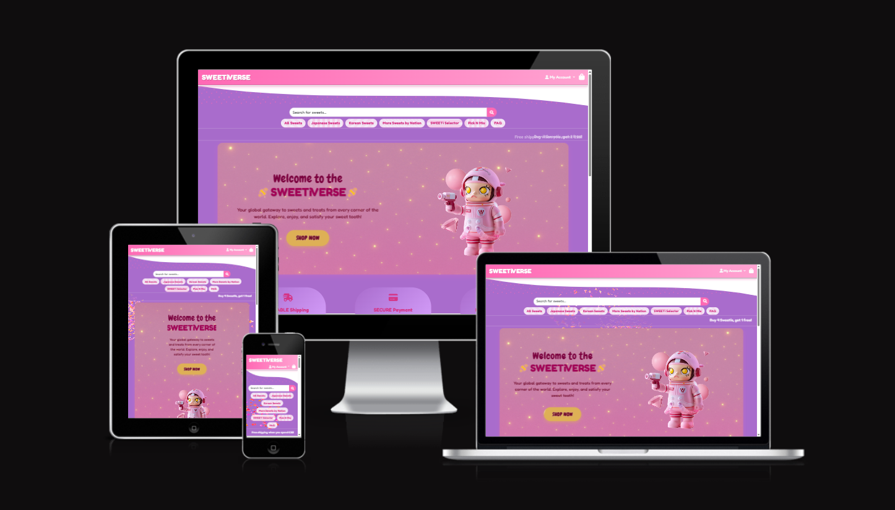
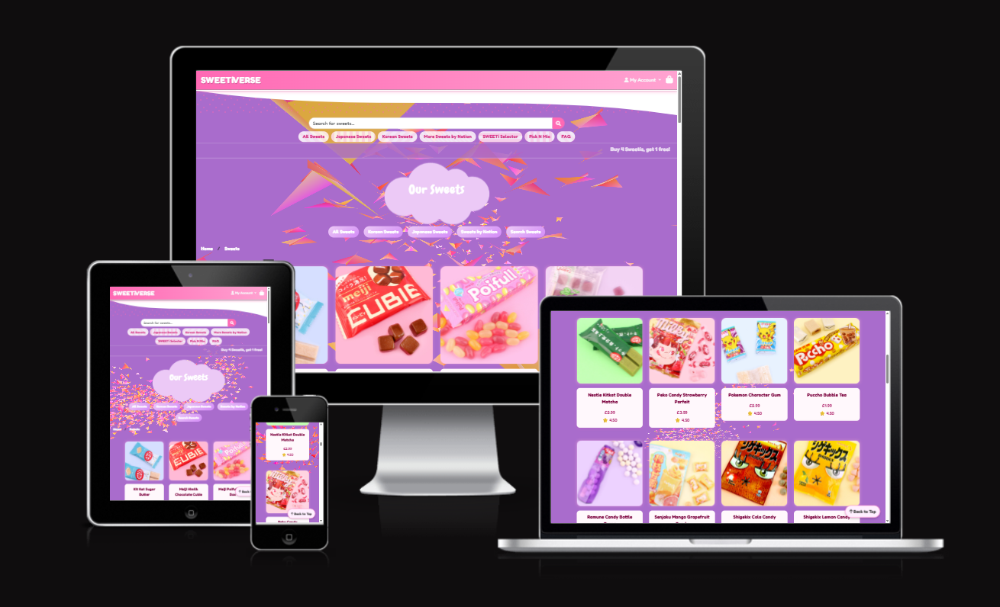
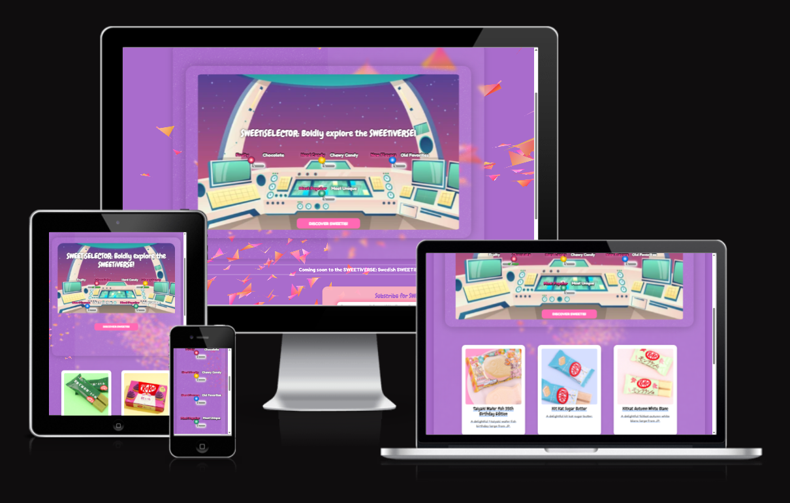
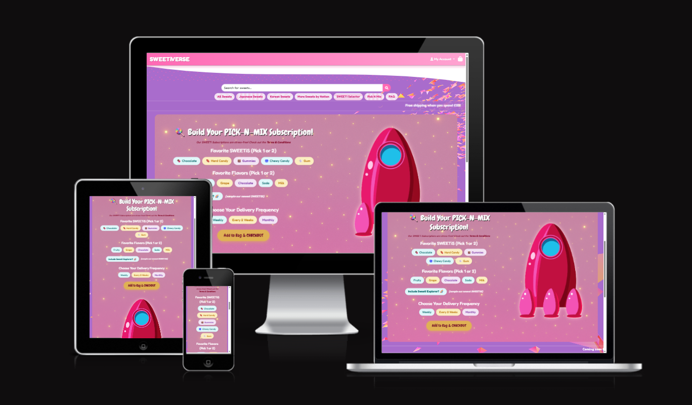
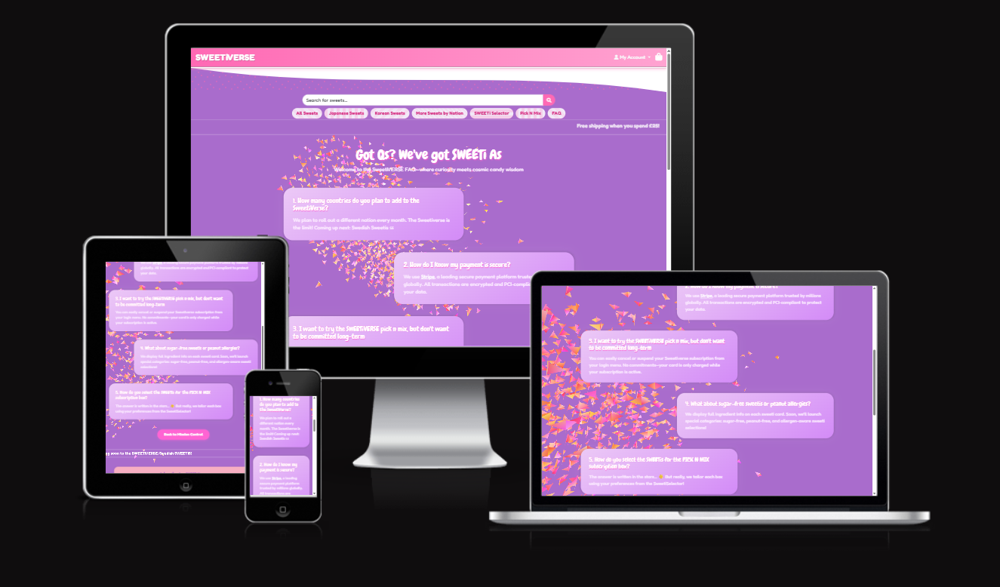
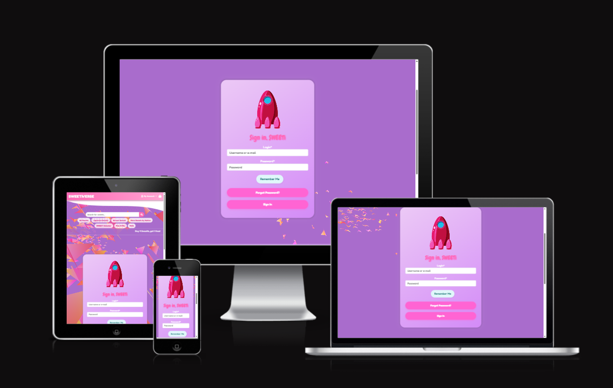

Go back to [README.md](/README.md)

# Testing
- [Code Validation](#code-validation)
    - [HTML](#html)
    - [CSS](#css)
    - [JavaScript](#JavaScript)
    - [Python](#python)
- [Responsiveness](#Responsiveness)
- [Browser Compatibility](#browser-compatibility)
- [Lighthouse](#Lighthouse)
- [Manual Testing](#manual-testing)
- [Automated Testing](#automated-testing)
- [User Story Testing](#user-story-testing)
- [Stripe](#stripe)

## Code Validation
### HTML
|Page|Validator|Result|
| --- | --- | --- |
| Home | | <mark>PASS<mark> |

### CSS
|file|Validator|Result|
| --- | --- | --- |
| style.css | | <mark>PASS<mark> |

## JavaScript
|file|Validator|Result|Comment|
| --- | --- | --- |----|
| admin_filter.js | | <mark>PASS<mark> ||

## Python

|File|App|Image|Result|Comment|
| --- |----| --- | --- |----|
| models | Checkout | | <mark>PASS<mark> ||

## Responsiveness
...

Testing of each page was conducted with AMIRESPONSIVE? I downloaded the Ignore X-Frames Headers Chrome Extension, thanks to this helpful article, which allowed me to bypass issues created by the Django tags: https://techsini.com/unable-to-generate-mockup-of-your-website-here-is-the-quick-fix/

AMIRESPONSIVE Screenshots (click)

## Browser Compatibility

|Browser|Result|Pass/Fail|Notes|
| --- | --- | --- | ---|
| Google Chrome | All pages load as expected. All features work as expected | PASS | --- |
| Safari | All pages load as expected. All features work as expected | PASS | --- |
| Edge | All pages load as expected. All features work as expected | PASS | ---|

## Lighthouse

|Page|Validator|Result|
| --- | --- | --- |
| Home Desktop | | <mark>PASS<mark> |

## Manual Testing

## Manual Testing

- Home Page 

|Section|Test Action|Expected Result|Pass/Fail|Comments|
| ---| ---| ---| ---| ---|
|Navbar|Click on logo in Navbar|Redirect to Home |Pass|Navbar present on all pages |

- SWEETiS Page 

|Section|Test Action|Expected Result|Pass/Fail|Comments|
| ---| ---| ---| ---| ---|
|Pagination| Click on all of the links in the pagination. Ensure they redirect to the appropriate page. |All links redirect to the correct page. |Pass| |

- Sweet Details Page 

|Section|Test Action|Expected Result|Pass/Fail|Comments|
| ---| ---| ---| ---| ---|
|Sweet details|Open the product page. Ensure all the relevant information is correct for the specific product|All the relevant information is correct for the specific product|Pass||

- Bag 

|Section|Test Action|Expected Result|Pass/Fail|Comments|
| ---| ---| ---| ---| ---|
|Bag|Add product to bag and ensure it appears correctly in the bag|The product appears correctly in the bag|Pass||

- Checkout

|Section|Test Action|Expected Result|Pass/Fail|Comments|
| ---| ---| ---| ---| ---|
|Checkout|Fill in the form and click on save details. Use stripe test card and confirm the order is successfull by checking stripe. Confirm the address is saved to profile|The address is saved to my profile. The purchase is successfull. Stripe logs show success.|Pass||

- User Profile

|Section|Test Action|Expected Result|Pass/Fail|Comments|
| ---| ---| ---| ---| ---|
|Profile|Fill in the form and click on update. Ensure the details are updated|The details are updated|Pass||

- Orders

|Section|Test Action|Expected Result|Pass/Fail|Comments|
| ---| ---| ---| ---| ---|
|Orders|Open the orders page and ensure the orders showing are correct. |The orders are correct|Pass||
|Orders |Click on the order link and ensure it leads to the order page|The link leads to the order page|Pass||

- Wishlist

|Section|Test Action|Expected Result|Pass/Fail|Comments|
| ---| ---| ---| ---| ---|
|wishlist|Visit my wishlist page. Click on the heart button on the card. Ensure the card is removed from favourites |The card is removed from favourites|Pass||
|wishlist|Visit my wishlist page. Click on the add to cart button on the card. Ensure the product is added to cart |The product is added to cart|Pass||
|wishlist|Visit my wishlist page. Click on the card. Ensure it redirects to the product's page. |It redirects to product's page|Pass||

- Admin

|Section|Test Action|Expected Result|Pass/Fail|Comments|
| ---| ---| ---| ---| ---|
|Orders|Visit orders page. Ensure the refine drop down works by selecting all available options |The refine drop down works as expected|Pass||
|Discount code|Visit discount code page. Ensure the refine drop down works by selecting all available options |The refine drop down works as expected|Pass||

## Automated testing

## User Story Testing

|User Story|Screenshot|Result|
| --- | --- | --- |
| As a developer I can set up a new Django project so that I can create the project's structure | The project was set up successfully| <mark>PASS<mark>  |

## Stripe
- Order created successfully

- Stripe webhooks

- Stripe Events

