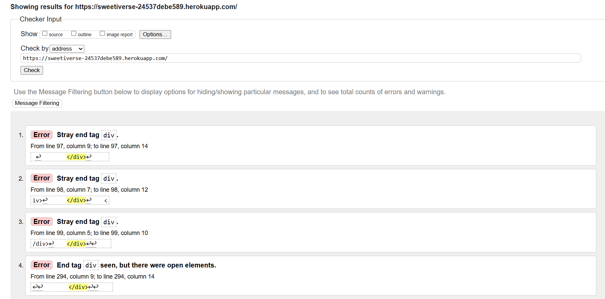
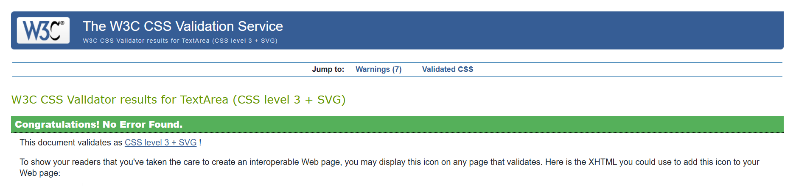
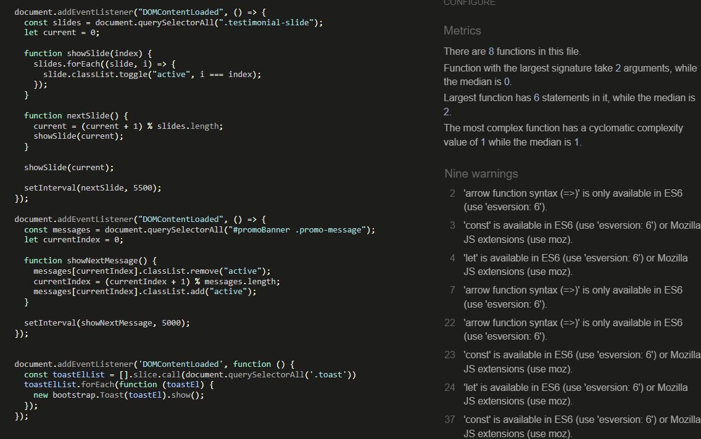
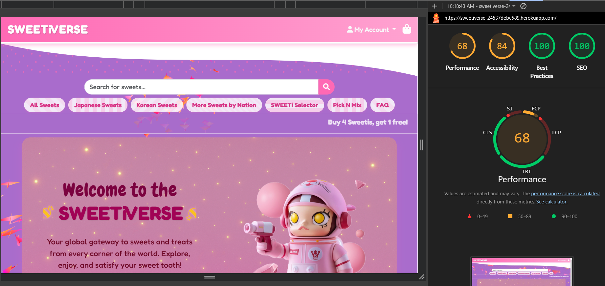

Go back to [README.md](/README.md)

# Testing
- [Code Validation](#code-validation)
    - [HTML](#html)
    - [CSS](#css)
    - [JavaScript](#JavaScript)
    - [Python](#python)
- [Responsiveness](#Responsiveness)
- [Browser Compatibility](#browser-compatibility)
- [Lighthouse](#Lighthouse)
- [Manual Testing](#manual-testing)
- [User Story Testing](#user-story-testing)
- [Stripe](#stripe)

## Code Validation
## HTML Validation Tests

- **HTML Validation**: Used the [W3C HTML Validator](https://validator.w3.org/) and returned the following results:

These errors were not found in the code and I believe are due to Django tags and extending base.html through the index and all other pages

## CSS Validation Tests

- **CSS Validation**: Used the [W3C CSS Validator](https://jigsaw.w3.org/css-validator/) and returned the following results:

## JavaScript
 **JavaScript Validation**: Used the [JShint Validator](https://jigsaw.w3.org/css-validator/) and this is an example of JS hint results from the site JavaScript. No console errors were found during testing and all implementation worked as designed:

## Python

**Python Validation**: Python files were validated using [CI Python Linter](https://pep8ci.herokuapp.com/) for PEP8 compliance.
To the best of my knowledge, all python logic throughout the project functions error free. I used the flake8 extension to help validate and format code as I worked. Most flagged issues occurred through lines > 79 characters. Most I have fixed, but some remain for the greater good of a working project

## Responsiveness
...

Testing of each page was conducted with AMIRESPONSIVE? I downloaded the Ignore X-Frames Headers Chrome Extension, thanks to this helpful article, which allowed me to bypass issues created by the Django tags: https://techsini.com/unable-to-generate-mockup-of-your-website-here-is-the-quick-fix/

AMIRESPONSIVE Screenshots (click)

SWEETiVERSE has been manually tested on an iPhone 13 Pro and an iPhone 12 for mobile, returning zero issues and passing
For desktop, SWEETiVERSE has been manually tested on a Windows Elitebook

## Browser Compatibility

|Browser|Result|Pass/Fail|Notes|
| --- | --- | --- | ---|
| Google Chrome | All pages load as expected. All features work as expected | PASS | --- |
| Safari | All pages load as expected. All features work as expected | PASS | --- |
| Edge | All pages load as expected. All features work as expected | PASS | ---|

## Lighthouse

- **Lighthouse Scores**: Used [Lighthouse Metrics](https://lighthouse-metrics.com/) to measure scores. SEO and Best Practices hit 100 score across most pages. Accessibility consistently passed. Performance scores overall did not pass on every page and is certainly something I will endeavor to improve in the future

## Manual Testing

| Section                         | Test Action                                                                 | Expected Result                                                                                         | Pass/Fail |
|----------------------------------|-----------------------------------------------------------------------------|----------------------------------------------------------------------------------------------------------|-----------|
| Home Page                        | Loads successfully                                                         | Logo, promo banners, trust badges, most popular SWEETis displayed                                       | ✅        |
| Favicon                          | Check browser tab                                                          | Candy icon appears as favicon                                                                           | ✅        |
| Navbar                           | Inspect on desktop and mobile                                              | Responsive navigation with dropdown and shopping bag icon                                               | ✅        |
| Toast Messages                   | Trigger actions like login, add to bag                                     | Toasts display with appropriate color and message                                                       | ✅        |
| User Dropdown Menu               | Open dropdown                                                              | Shows Login/Register or Profile/Wishlist/Admin options depending on auth status                         | ✅        |
| Admin Dropdown Links             | Log in as admin, open menu                                                 | See "+ Add Sweet" and link to Django admin panel                                                        | ✅        |
| Profile Page                     | Log in, open dropdown > Profile                                            | Update delivery info, view orders, manage subscriptions                                                 | ✅        |
| Shopping Bag                     | Add item, view bag                                                         | Item appears with update/remove/wishlist buttons and checkout option                                    | ✅        |
| Empty Shopping Bag               | Click bag icon without adding anything                                     | Message and redirect to Sweets page                                                                     | ✅        |
| Search Bar                       | Search for SWEETis                                                         | Returns matching SWEETis with pagination                                                                | ✅        |
| Promo Banner                     | View homepage                                                              | Promo messages scroll in top banner                                                                     | ✅        |
| Coming Soon Banner               | Scroll homepage                                                            | "Coming Soon" banner is visible                                                                         | ✅        |
| Feature Section                  | Scroll homepage                                                            | Mascot, headline, and "Shop Now" button displayed                                                       | ✅        |
| Trust Badges                     | Scroll homepage                                                            | Secure payment, shipping badge, and subscription info shown                                             | ✅        |
| Most Popular SWEETis            | Scroll homepage                                                            | Most recent sweets shown                                                                                | ✅        |
| Newsletter Signup                | Enter email, submit                                                        | Confirmation and discount toast triggered                                                               | ✅        |
| Footer                           | Scroll to bottom                                                           | Link to Privacy Policy                                                                                  | ✅        |
| Privacy Policy                   | Click footer link                                                          | Full privacy policy text loads                                                                          | ✅        |
| Background Animation             | View homepage and other pages                                              | Vanta.js birds animation loads without interfering with content                                         | ✅        |
| Registration                     | Register with valid info                                                   | Account created, user logged in, redirected                                                             | ✅        |
| Login/Logout                     | Log in and out                                                             | Correct redirection and toasts triggered                                                                | ✅        |
| Password Reset                   | Submit email via password reset                                            | Email sent with reset link                                                                              | ✅        |
| Sweets Page                      | Navigate to Sweets                                                         | All SWEETis listed with sort and filter options                                                         | ✅        |
| Sweet Detail                     | Click on SWEETi card                                                       | Detail page with ingredients, rating, and related suggestions                                           | ✅        |
| Reviews Section                  | Scroll below SWEETi detail                                                 | Displays reviews and allows logged-in users to post if purchased                                        | ✅        |
| Review Permissions               | Attempt to review without purchase                                         | Review action blocked                                                                                    | ✅        |
| Wishlist                         | Click wishlist button as guest or user                                     | Guest prompted to log in, user adds/removes successfully                                                | ✅        |
| Sweets Search                    | Use filters and search                                                     | Accurate filtered and paginated results                                                                 | ✅        |
| Checkout                        | Add to bag, complete payment                                               | Stripe processes payment, user receives email and success screen                                        | ✅        |
| Promo Codes                     | Apply valid/invalid code                                                   | Code accepted or error message shown                                                                    | ✅        |
| Sweetistravaganza Logic         | Add qualifying number of sweets                                            | Discount applied at checkout                                                                            | ✅        |
| Order Summary                   | View order summary on profile                                              | Order history visible and accurate                                                                      | ✅        |
| Email Confirmation              | Complete order                                                             | Order confirmation email received                                                                       | ✅        |
| SWEETi Selector                 | Pull lever to get suggested sweets                                         | Random suggestions based on chosen filters                                                              | ✅        |
| Pick N Mix Subscription         | Subscribe, pause, cancel                                                   | Subscriptions managed and reflected in profile                                                          | ✅        |
| Subscription Admin View         | Log in as admin, check subscriptions                                       | Subscriptions visible in Django admin                                                                   | ✅        |
| FAQ Page                        | Open FAQ                                                                   | All accordion questions/answers visible                                                                 | ✅        |
| Delete Popups                   | Try deleting from wishlist or subscription                                 | Confirmation dialog appears                                                                             | ✅        |
| 404 Page                        | Visit a broken link                                                        | Custom 404 page with navigation link                                                                    | ✅        |
| 500 Page                        | Trigger internal error (e.g. temporarily break a view)                     | Custom 500 page shown                                                                                   | ✅        |

## User Story Testing

| **User Story** | **Description** | **Status** |
| --- | --- | --- |
| US - Project Setup | As a **developer** I can set up a new Django project so that I can establish the project structure. | ✅ |
| US - Storage Setup | As a **developer** I can connect the database and media storage so that user data and images are stored successfully. | ✅ |
| US - Early Deployment | As a **developer** I can deploy the application early so that I can verify everything works and continue testing during development. | ✅ |
| US - Homepage | As a **user** I can visit the homepage so I understand the purpose of Sweetiverse. | ✅ |
| US - Navigation | As a **user** I can navigate the website efficiently to access different sections like products, help, or cart. | ✅ |
| US - Browse Sweets | As a **user** I want to be able to view all available sweets so that I can browse and discover treats to purchase. | ✅ |
| US - Sweet Details | As a **user** I want to view detailed information about a single sweet so I can make informed decisions. | ✅ |
| US - Filter Sweets | As a **user** I want to filter sweets by country or category so I can find exactly what I’m interested in. | ✅ |
| US - Search Sweets | As a **user** I want to search for sweets by keywords so that I can quickly find specific items. | ✅ |
| US - Sort Sweets | As a **user** I want to sort the sweet list by name or price so I can easily compare options. | ✅ |
| US - Register | As a **user** I want to register an account so I can access full functionality. | ✅ |
| US - Login | As a **user** I want to log in to my account so I can personalize my experience. | ✅ |
| US - Password Reset | As a **user** I want to reset my password if I forget it so I can regain access. | ✅ |
| US - Profile Update | As a **user** I want to update my profile information so I can keep my account current. | ✅ |
| US - Submit Review | As an **authenticated user** I want to leave reviews for sweets so I can share feedback. | ✅ |
| US - Edit/Delete Review | As an **authenticated user** I want to edit or delete my reviews to keep them relevant. | ✅ |
| US - Wishlist | As an **authenticated user** I want to add sweets to my wishlist so I can save them for later. | ✅ |
| US - Add to Cart | As a **user** I want to add products to my cart so I can review them before purchase. | ✅ |
| US - Remove from Cart | As a **user** I want to remove items from my cart so I can adjust my order. | ✅ |
| US - Adjust Quantity | As a **user** I want to adjust the quantity of items in my cart for accurate purchasing. | ✅ |
| US - Apply Discount | As a **user** I want to apply discount codes to get deals and savings. | ✅ |
| US - Stripe Payment | As a **user** I want to securely pay for items using Stripe so I can complete purchases confidently. | ✅ |
| US - Smooth Checkout | As a **user** I want to complete checkout easily so I can buy sweets without friction. | ✅ |
| US - Admin Dashboard | As an **admin** I want to view an admin dashboard to monitor orders and activity. | ✅ |
| US - Manage Inventory | As an **admin** I want to add, update, or delete sweets so I can manage the inventory. | ✅ |
| US - Adjust Stock | As an **admin** I want to adjust stock levels to maintain availability. | ✅ |
| US - Submit Testimonial | As a **user** I want to submit a testimonial about my experience to share feedback. | ✅ |
| US - View Testimonials | As a **user** I want to read other users’ testimonials to build trust. | ✅ |
| US - Newsletter Signup | As a **user** I want to sign up for a newsletter so I can stay updated with offers. | ✅ |
| US - SEO Optimization | As the **site owner** I want the site to be SEO optimized so Sweetiverse ranks higher and attracts more users. | ✅ |
